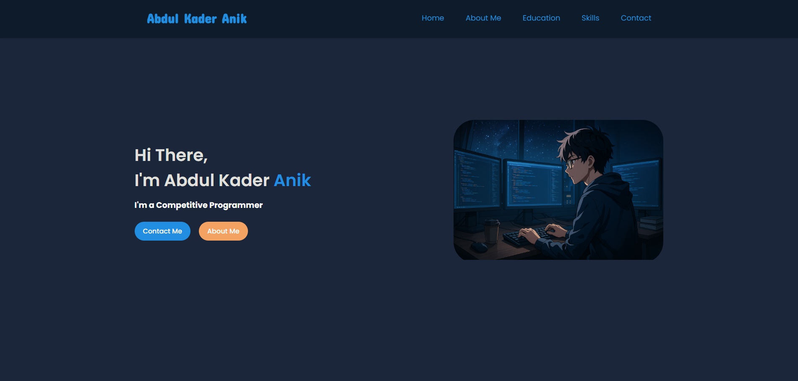

# Portfolio
# 👨‍💻 Abdul Kader Anik - Portfolio Website

Welcome to my personal portfolio website!  
I'm **Abdul Kader Anik**, a competitive programmer and a Computer Science student at **Shanto-Mariam University of Creative Technology**.

This site showcases my background, skills, achievements, and ways to connect with me.

---

## 📸 Preview

---

## 🌐 Live Site

[🔗 Visit My Portfolio](https://anik071.github.io/portfolio/)  

---

## 📁 Folder Structure

/portfolio
│
├── index.html → Main HTML file
├── style.css → All styling and layout
├── hero-section-photo.png (or any image you used)
├── /assets → (Optional) Additional images or icons
└── README.md → This file

---

## 🛠️ Features

- ✅ Responsive Design (Mobile Friendly)
- ✅ Smooth Navigation Bar
- ✅ Hero Section with Profile and Buttons
- ✅ About Me & Skills Section
- ✅ Social Links (Email, WhatsApp, GitHub, LinkedIn, etc.)
- ✅ Clean, modern UI using Google Fonts

---

## 🧑‍💻 Technologies Used

- **HTML5**
- **CSS3**
- **JavaScript (Vanilla)** – For interactivity and DOM manipulation
- **Responsive Design** (Media Queries)
- **Font Awesome** (for icons)
- **Google Fonts**

---

## 🎨 Color Palette Used

| Purpose       | Description       | Hex Code     |
|---------------|-------------------|--------------|
| Background    | Dark Navy         | `#1f2739`     |
| Header        | Deeper Navy       | `#141b29`     |
| Primary Text  | Light Gray        | `#d6d6d6`     |
| Accent Text   | Muted Blue        | `#677489`     |
| Name Highlight| Bright Blue       | `#3193f5`     |
| Button 1      | Blue Button       | `#3193f5`     |
| Button 2      | Orange Button     | `#f5a25b`     |

---

## 📱 Responsive Design

This website is designed to work smoothly on:

- Desktop
- Tablet
- Mobile

It uses `@media` queries to adapt the layout on different screen sizes.

---

## 🧑‍💻 Author's Contact

**Abdul Kader Anik**  
📧 [Email Me](mailto:anik.232071071@smuct.ac.bd)  
💬 [WhatsApp](https://wa.me/8801880807633)

---

## 📌 License

This project is free to use under the [MIT License](LICENSE).
